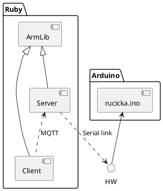

# IoT Robotic Arm
----
## Architecture overview

```plantuml
@startuml
package "Ruby" {
  [Server]
  [Client]
  [ArmLib]
}

package "Arduino" {
  [rucicka.ino] as ar
}

[Server] <.. [Client] : MQTT
[ArmLib] <|-- [Client]
[ArmLib] <|-- [Server]

[Server] ..> HW : Serial link
ar <-- HW

@enduml
```
