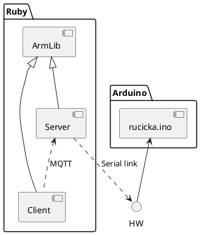

# IoT Robotic Arm
----
## How to flash controll board
 - Install Arduino IDE
 - Open Arduino IDE
 - Open `Tools` tab
 - Set:
   - `Board` to `Arduino Duemilanove or Diecimila`
   - `Processor` to `ATmega328P`
   - `Port` to first available
- make cahnges - optional
- click on `Upload`
## Architecture overview

